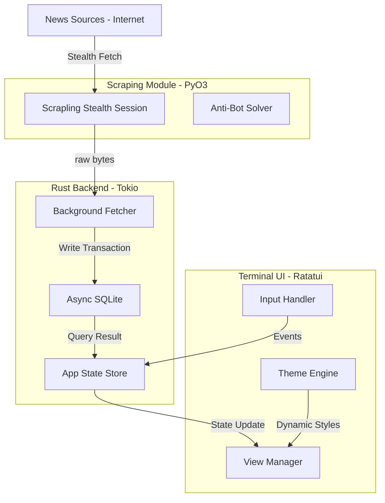

# 🚀 Live News TUI: Terminal Intelligence Engine

**Live News TUI** adalah platform agregator berita berbasis terminal yang dibangun dengan filosofi "Speed, Stealth, and Stability". Menggabungkan performa tinggi bahasa **Rust** dengan kecanggihan mesin scraping **Python (Scrapling)**, aplikasi ini memberikan akses berita real-time dari seluruh dunia langsung ke workstation Anda tanpa iklan, tanpa pelacakan, dan tanpa hambatan bot-protection.

---

## ✨ Fitur Unggulan

### 🕵️ Stealth Engine (Rust + Python Hybrid)
Mengintegrasikan library `Scrapling` melalui bridge `PyO3`, aplikasi ini mampu mensimulasikan perilaku manusia yang sangat nyata untuk melewati proteksi seperti Cloudflare 403/429. Data diambil dalam format raw bytes, lalu diproses secara asinkron menggunakan parsing feed berperforma tinggi di sisi Rust.

### 🌐 Cakupan Berita Global yang Masif
Nikmati akses ke berbagai kategori berita kelas dunia:
- **🇮🇩 Indonesia**: Detikcom, Kompas, Antara, CNN Indonesia, Liputan6, Merdeka.
- **🌍 World & Geopolitics**: Reuters Politics, BBC News, NYT World, Al Jazeera, SCMP, The Guardian.
- **💰 Finance & Business**: Bloomberg Markets, Wall Street Journal, Financial Times, CNBC, The Economist, Investing.com.
- **🔬 Tech & AI**: Hacker News, TechCrunch, OpenAI, DeepMind, The Verge, Wired.
- **₿ Crypto**: CoinDesk, CoinTelegraph, Bitcoin Magazine.
- **🧪 Science & Health**: NASA, Nature, Science Daily, Healthline.
- **🎭 Lifestyle & Culture**: Vogue, GQ, National Geographic, Rolling Stone.
- **⚽ Sports**: ESPN, BBC Sport.

### 🎨 Antarmuka GitUI Aesthetic
Didesain dengan inspirasi estetika **GitUI**, menawarkan layout panel yang bersih, border membulat (rounded), dan navigasi yang sangat responsif.
- **Multi-Theme Engine**: Black (Default), White (High Contrast), DeepBlue (Modern), dan Matrix (Classic Green).
- **Adaptive Search**: Bar pencarian cerdas (`/`) yang memfilter judul dan deskripsi secara instan.
- **Sync Countdown**: Indikator hitung mundur di header yang memberitahu Anda kapan sinkronisasi berikutnya terjadi secara presisi.

---

## 🏛️ Arsitektur Sistem

Aplikasi ini menggunakan arsitektur *multi-layered* untuk menjamin skalabilitas dan efisiensi sumber daya:

### Visual Data Flow (Mermaid)



---

## 🛠️ Panduan Instalasi & DevOps

### 1. Prasyarat
- **Rust Toolchain** (1.75+)
- **Python 3.10+**
- Library Scrapling: `pip install scrapling`

### 2. Instalasi Cepat (One-Command)
```bash
./install.sh
```
Skrip ini akan mengonfigurasi dependensi sistem, mengompilasi biner dalam mode `--release`, dan menambahkannya ke PATH Anda.

### 3. Pemeliharaan
- **Update**: `./update.sh` (Sinkronisasi dengan repo utama dan kompilasi ulang).
- **Uninstall**: `./uninstall.sh` (Menghapus biner dari sistem).

---

## ⌨️ Navigasi & Pintasan Keyboard

| Tombol | Aksi |
| :--- | :--- |
| `/` | Membuka bar pencarian |
| `t` | Mengganti tema warna secara instan |
| `Enter` | Membaca detail berita terpilih |
| `Esc / q` | Kembali ke daftar atau keluar dari aplikasi |
| `h / l` | Berpindah antar kategori berita |
| `j / k` | Navigasi daftar berita (Atas/Bawah) |
| `?` | Menampilkan menu bantuan (Popup) |

---

## ⚙️ Konfigurasi (config.toml)
Konfigurasi dapat disesuaikan di `~/.config/live_news_tui/config.toml` (Linux/macOS) atau lokasi standar Windows:
- `retention`: Durasi penyimpanan berita (Hourly, Daily, Weekly).
- `fetch_interval_active_seconds`: Frekuensi update saat jam aktif.
- `worker_threads`: Jumlah koneksi simultan untuk fetching.

---

## 📄 Lisensi & Kontribusi
Proyek ini **100% Gratis** dan Open Source. Kontribusi sangat dihargai untuk memperluas jangkauan sumber berita global lainnya.

---
*Built with ❤️ by Senior Rust Engineers for the global community.*
