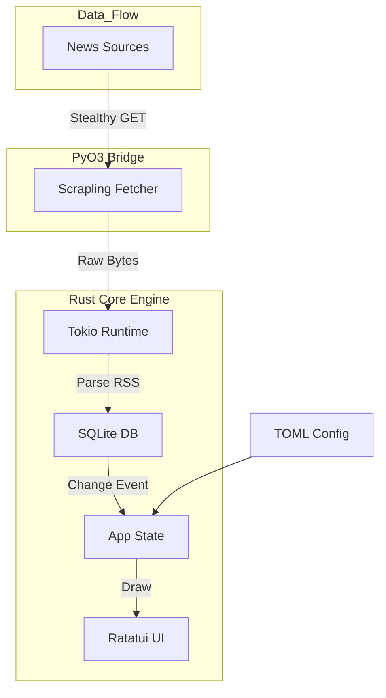

# Live News TUI 🚀

Live News TUI adalah aplikasi Terminal User Interface (TUI) berbasis Rust yang menyediakan feed berita real-time secara gratis, cepat, dan efisien. Aplikasi ini mengintegrasikan mesin scraping canggih berbasis Python (**Scrapling**) untuk melewati proteksi anti-bot dan menyediakan data dari berbagai sumber global.

## ✨ Fitur Unggulan

- **Stealthy Fetching**: Menggunakan `Scrapling` (Python) melalui `PyO3` dengan fitur `solve_cloudflare=True` untuk akses berita tanpa hambatan.
- **Berbagai Kategori Berita**:
  - **Finansial**: Bloomberg, WSJ, CNBC, Financial Times, The Economist.
  - **Geopolitik & Dunia**: Reuters, BBC, NYT, Al Jazeera, The Guardian.
  - **Teknologi & AI**: Hacker News, TechCrunch, OpenAI, DeepMind.
  - **Gaya Hidup**: National Geographic, Vogue, GQ, Rolling Stone.
  - **Indonesia**: Detik, Kompas, Antara, CNN Indonesia.
- **Refresh Countdown**: Indikator hitung mundur real-time di header (Sync Countdown).
- **GitUI Aesthetic**: Layout modern dengan panel, border bulat, dan navigasi intuitif.
- **Multi-Theme Engine**: 4 tema warna (Black, White, DeepBlue, Matrix).
- **Search & Filter**: Pencarian adaptif dengan menekan `/`.

## 🏛️ Arsitektur Sistem

### Alur Data (Rust + Python Hybrid)



## 🛠️ Manajemen Aplikasi

### 📥 Instalasi (Otomatis)
```bash
./install.sh
```
*Pastikan Python 3 dan `pip install scrapling` tersedia di sistem Anda.*

### 🔄 Update & 🗑️ Uninstall
```bash
./update.sh
./uninstall.sh
```

## ⌨️ Navigasi & Pintasan

- **/** : Buka Pencarian.
- **t** : Ganti Tema Warna.
- **Enter** : Baca detail berita.
- **Esc / q** : Kembali / Keluar.
- **h / l** : Ganti kategori.
- **?** : Bantuan.

## 📄 Lisensi

Sepenuhnya gratis dan terbuka.
