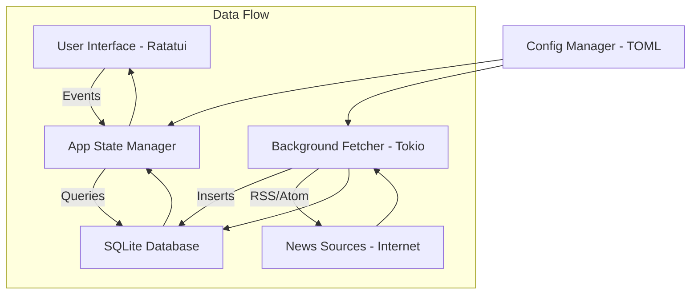

# Live News TUI 🚀

Live News TUI adalah aplikasi Terminal User Interface (TUI) berbasis Rust yang menyediakan feed berita real-time secara gratis, cepat, dan efisien. Dirancang untuk performa maksimal dengan penggunaan sumber daya minimal.

## ✨ Fitur Utama

- **Real-Time News**: Mengambil berita terbaru dari berbagai sumber RSS/Atom secara otomatis.
- **Search & Filter**: Cari berita spesifik dengan menekan `/` dan filter berdasarkan kategori.
- **Efisiensi Tinggi**: Menggunakan SQLite untuk caching data dan optimasi rendering UI berbasis event.
- **Production-Ready**: Dilengkapi dengan manajemen retensi data, sinkronisasi latar belakang, dan konfigurasi fleksibel.
- **Hemat Sumber Daya**: Arsitektur asinkron (Tokio) memastikan penggunaan CPU dan RAM yang sangat rendah.
- **Gratis & Terbuka**: Sepenuhnya gratis untuk digunakan selamanya.

## 🏛️ Arsitektur Sistem



### Visual ASCII Architecture:
```text
+---------------------------------------+
|          Live News TUI (UI)           |
+-------------------+-------------------+
|  Category Sidebar |   News Feed List  |
+-------------------+-------------------+
          |                  ^
          v                  |
+---------------------------------------+
|          App State Manager            |
+-------------------+-------------------+
          |                  ^
          v                  |
+---------------------------------------+
|           SQLite Database             |
+---------------------------------------+
          ^                  |
          |                  v
+---------------------------------------+
|        Background Fetcher Task        |
+---------------------------------------+
          |
          v
+---------------------------------------+
|         External News Sources         |
+---------------------------------------+
```

## 🛠️ Panduan DevOps (Instalasi & Manajemen)

### 📥 Instalasi (Satu Perintah)
Gunakan skrip instalasi otomatis untuk mengunduh dependensi, mengompilasi, dan memasang biner:
```bash
./install.sh
```

### 🔄 Update (Satu Perintah)
Perbarui aplikasi ke versi terbaru langsung dari repositori:
```bash
./update.sh
```

### 🗑️ Uninstall (Satu Perintah)
Hapus biner aplikasi dari sistem Anda:
```bash
./uninstall.sh
```

## ⚙️ Konfigurasi

File konfigurasi otomatis dibuat pada saat pertama kali dijalankan di lokasi standar OS Anda (misalnya `~/.config/live_news_tui/config.toml`).

## ⌨️ Navigasi UI

- **/**: Membuka bar pencarian (Search).
- **q / Esc**: Keluar atau Kembali.
- **Enter**: Membaca detail artikel.
- **j / k / ⬆ / ⬇**: Navigasi daftar berita.
- **h / l / ⬅ / ➡**: Berpindah kategori berita.

## 📄 Lisensi

Proyek ini sepenuhnya gratis untuk digunakan.
