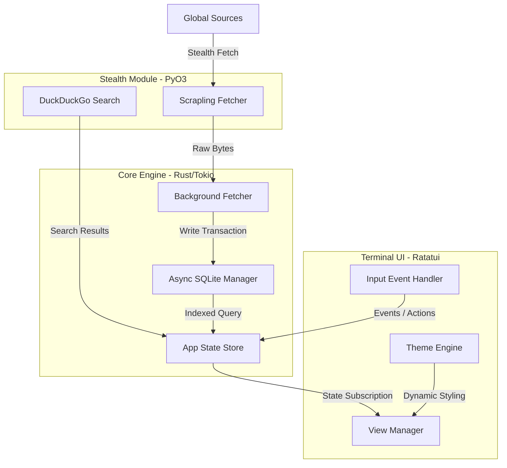

# 🚀 Live News TUI: The Ultimate Terminal Intelligence Aggregator

**Live News TUI** adalah platform agregator berita berbasis Terminal User Interface (TUI) tingkat elit. Dirancang untuk kecepatan milidetik, privasi mutlak, dan estetika profesional kelas workstation. Aplikasi ini menggabungkan ketangguhan sistem **Rust** dengan fleksibilitas mesin scraping **Python (Scrapling)** dan kemampuan pencarian global **DuckDuckGo** untuk menghadirkan berita global secara stealth.

---

## ✨ Fitur Unggulan (Elite Features)

### 🕵️ Stealth Scraping Engine (Hybrid Architecture)
Ditenagai oleh library `Scrapling` di sisi Python yang diintegrasikan secara native melalui `PyO3`.
- **Anti-Bot Bypass**: Menembus proteksi Cloudflare (403/429) secara otomatis.
- **Stealthy Sessions**: Mensimulasikan sidik jari browser manusia asli.

### 🔍 Custom Global Search (DuckDuckGo Integration)
Bosan dengan sumber yang ada? Cari berita apapun di seluruh dunia secara real-time:
- **Global Search (`s`)**: Tekan `s` untuk melakukan pencarian kata kunci global menggunakan engine DuckDuckGo.
- **Instant Filtering**: Filter hasil pencarian secara instan langsung di terminal.

### 🌐 Cakupan Berita Masif (100+ Premium Sources)
- **🇮🇩 Indonesia Premium**: Detikcom, Kompas, Antara, CNN ID, CNBC ID, Tempo, Bisnis.com, Republika, Kumparan.
- **🌍 Geopolitik & World**: Reuters, BBC, NYT World, Al Jazeera, SCMP, The Guardian, DW, France 24.
- **💰 Finance & Global Economy**: Bloomberg, WSJ, Financial Times, The Economist, Investing.com, Forbes.
- **🔬 Tech, AI & Innovation**: Hacker News, TechCrunch, OpenAI, DeepMind, The Verge, Wired.
- **₿ Crypto & Web3**: CoinDesk, CoinTelegraph, Bitcoin Magazine, Decrypt, The Block.
- **🧪 Science & Health**: NASA, Nature, Science Daily, Healthline, WHO, LiveScience.

### ⚡ Performa Workstation Modern
- **Rust/Tokio Core**: Arsitektur asinkron untuk performa tanpa hambatan.
- **SQLite WAL Mode**: Database teroptimasi untuk manajemen ribuan artikel.
- **Sync Countdown**: Indikator hitung mundur real-time untuk sinkronisasi berita.

---

## 🏛️ Arsitektur Sistem

### Visual Alur Data (Hybrid Rust-Python)



---

## 🛠️ Panduan Instalasi & DevOps

### 1. Prasyarat
- **Rust Toolchain** (v1.75+)
- **Python** (v3.10+)
- **Dependencies**: `pip install scrapling duckduckgo-search`

### 2. Instalasi Satu Perintah
```bash
./install.sh
```

---

## ⌨️ Navigasi & Pintasan Keyboard

| Tombol | Aksi |
| :--- | :--- |
| `s` | **Global Search**: Cari topik berita apapun di dunia (via DDG) |
| `/` | **Local Search**: Filter berita di kategori yang sedang dibuka |
| `t` | **Theme**: Ganti tema (Black, White, DeepBlue, Matrix) |
| `o` | **Open**: Buka URL berita di Browser sistem default |
| `Enter` | **Read**: Baca detail artikel di terminal |
| `Esc / q` | **Back**: Kembali ke daftar berita atau keluar aplikasi |
| `h / l` | **Category**: Navigasi antar tab kategori |
| `j / k` | **Navigate**: Scroll daftar berita |
| `?` | **Help**: Tampilkan jendela bantuan |

---

## 📄 Lisensi
Proyek ini **100% Open Source & Gratis** selamanya.

---
*Built with ❤️ by Senior Rust Engineers for the global intelligence community.*
