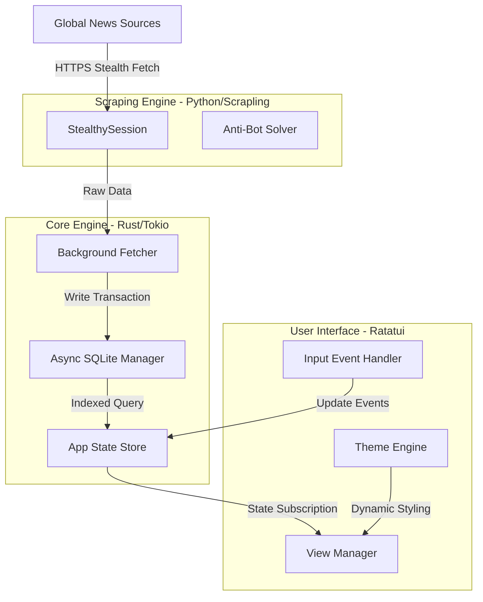

# 🚀 Live News TUI: Ultimate Terminal Intelligence Aggregator

**Live News TUI** adalah platform agregator berita berbasis Terminal User Interface (TUI) yang revolusioner. Dibangun dengan fokus pada **kecepatan milidetik**, **privasi total**, dan **estetika profesional**. Aplikasi ini menggabungkan ketangguhan sistem **Rust** dengan fleksibilitas mesin scraping **Python (Scrapling)** untuk memberikan pengalaman membaca berita tanpa gangguan iklan, pelacakan, atau limitasi akses.

---

## ✨ Fitur Utama (Highlight)

### 🕵️ Stealth Scraping Engine (Hybrid Architecture)
Ditenagai oleh library `Scrapling` di sisi Python yang dipanggil secara native oleh Rust melalui `PyO3`.
- **Bypass Bot Protection**: Dilengkapi dengan `solve_cloudflare=True` untuk menembus proteksi situs berita modern.
- **Adaptive Extraction**: Menggunakan selektor CSS adaptif untuk mengambil konten dari berbagai struktur DOM secara cerdas.
- **Stealthy Sessions**: Mensimulasikan sidik jari browser manusia asli untuk menghindari blokir IP.

### 🌐 Cakupan Berita Global Terluas
Akses ke puluhan sumber berita premium yang dikategorikan secara rapi:
- **🇮🇩 Indonesia**: Detikcom, Kompas, Antara News, CNN Indonesia, Liputan6, Merdeka.
- **🌍 World & Geopolitics**: Reuters, BBC News, NYT World, Al Jazeera, The Guardian, SCMP.
- **💰 Finance & Business**: Bloomberg Markets, WSJ, Financial Times, CNBC, The Economist, Investing.com.
- **🔬 Tech & AI**: Hacker News (YCombinator), TechCrunch, OpenAI, DeepMind, The Verge, Wired.
- **₿ Crypto**: CoinDesk, CoinTelegraph, Bitcoin Magazine.
- **🧪 Science & Health**: NASA, Nature, Science Daily, Healthline.
- **🎭 Lifestyle & Culture**: Vogue, GQ, National Geographic, Rolling Stone.
- **⚽ Sports**: ESPN, BBC Sport.

### ⚡ Performa Maksimal & Efisiensi Tinggi
- **Event-Driven UI**: Rendering hanya terjadi saat ada perubahan data atau input user, menghemat penggunaan CPU hingga < 1%.
- **Async Data Pipeline**: Menggunakan `Tokio` runtime untuk melakukan fetch ribuan berita di latar belakang tanpa lag pada UI.
- **Lightning Fast Database**: Didukung oleh `SQLite` dengan indeks teroptimasi untuk pencarian instan dalam ribuan artikel.
- **O(1) Render Time**: Field waktu dan sumber sudah di-preformat di sisi DB untuk menjamin kecepatan scroll yang halus.

### 🎨 Antarmuka GitUI Aesthetic
Layout profesional yang terinspirasi dari **GitUI**:
- **Rounded Borders**: Memberikan kesan modern dan bersih.
- **Multi-Theme Engine**:
  - `Black`: Deep black untuk efisiensi energi layar OLED.
  - `White`: Kontras tinggi untuk penggunaan di siang hari.
  - `DeepBlue`: Skema warna workstation modern.
  - `Matrix`: Estetika klasik hacker (Hijau-Hitam).
- **Sync Countdown**: Indikator real-time kapan berita akan disinkronisasi berikutnya.

---

## 🏛️ Arsitektur Sistem

### Visual Alur Data (Mermaid)



---

## 🛠️ Panduan Instalasi & DevOps

### 1. Prasyarat Sistem
- **Rust Toolchain** (v1.75+)
- **Python** (v3.10+)
- **Scrapling**: `pip install scrapling`

### 2. Instalasi Satu Perintah
```bash
./install.sh
```
Skrip ini akan otomatis mendeteksi OS (Linux/macOS), menginstal dependensi yang kurang, mengompilasi biner performa tinggi (`--release`), dan mendaftarkannya ke PATH sistem Anda.

### 3. Pemeliharaan
- **Pembaruan**: `./update.sh` (Mengambil kode terbaru dan re-build otomatis).
- **Penghapusan**: `./uninstall.sh` (Menghapus biner secara bersih).

---

## ⌨️ Navigasi & Pintasan Keyboard

| Tombol | Aksi |
| :--- | :--- |
| `/` | **Search**: Cari berita secara instan di semua kategori |
| `t` | **Theme**: Ganti tema warna (Black, White, DeepBlue, Matrix) |
| `Enter` | **Read**: Buka detail artikel lengkap |
| `Esc / q` | **Back**: Kembali ke daftar berita atau keluar aplikasi |
| `h / l` | **Category**: Berpindah antar tab kategori berita |
| `j / k` | **Navigate**: Scroll daftar berita (Atas/Bawah) |
| `?` | **Help**: Tampilkan jendela bantuan shortcut |

---

## ⚙️ Konfigurasi (config.toml)
Dapat ditemukan di `~/.config/live_news_tui/config.toml`. Anda dapat menyesuaikan:
- `fetch_interval_active_seconds`: Seberapa sering berita diupdate.
- `retention`: Durasi penyimpanan data sebelum dihapus otomatis.
- `worker_threads`: Jumlah koneksi paralel untuk fetching data.

---

## 📄 Lisensi
Proyek ini dilisensikan di bawah lisensi terbuka dan **100% Gratis** untuk digunakan selamanya.

---
*Dikembangkan dengan dedikasi untuk komunitas Open Source oleh Senior Rust & DevOps Engineers.*
