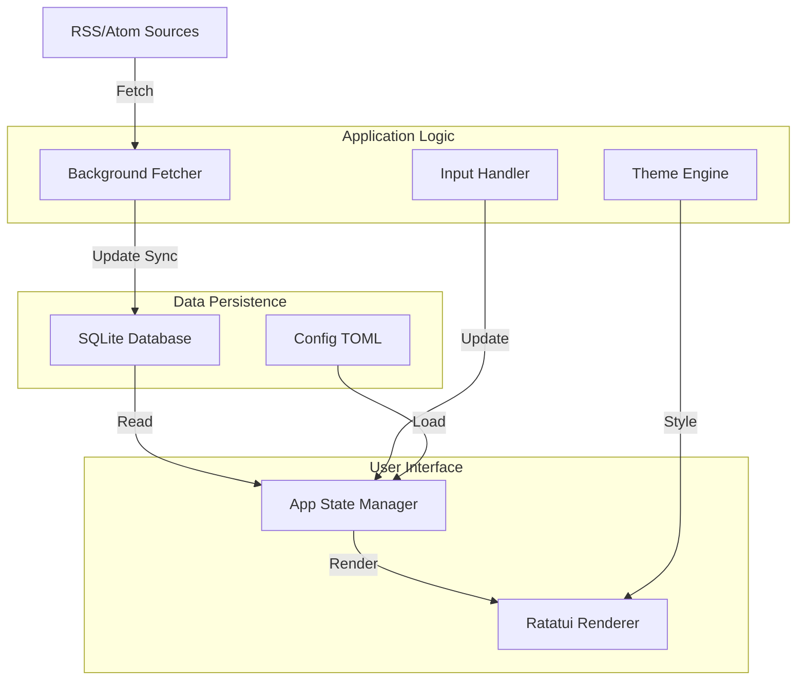

# Live News TUI 🚀

Live News TUI adalah aplikasi Terminal User Interface (TUI) berbasis Rust yang menyediakan feed berita real-time secara gratis, cepat, dan efisien. Terinspirasi dari estetika **GitUI**, aplikasi ini menawarkan pengalaman navigasi keyboard-only yang responsif.

## ✨ Fitur Unggulan

- **Estetika GitUI**: Layout modern dengan border bulat dan skema warna yang profesional.
- **Berbagai Kategori Berita**:
  - **Finansial**: Bloomberg, WSJ, CNBC, Financial Times.
  - **Geopolitik & Dunia**: BBC, NYT, Al Jazeera, Reuters, The Guardian.
  - **Teknologi & AI**: Hacker News, TechCrunch, OpenAI, DeepMind.
  - **Gaya Hidup**: Vogue, GQ, Rolling Stone, National Geographic.
  - **Indonesia**: Detik, Kompas, Antara, CNN Indonesia.
- **Refresh Countdown**: Indikator hitung mundur di header untuk mengetahui kapan berita berikutnya akan diambil.
- **Color Themes**: Pilihan tema warna (Black, White, DeepBlue, Matrix) yang dapat diubah secara instan dengan tombol `t`.
- **Search & Filter**: Cari berita secara real-time dengan menekan `/`.
- **Production-Ready**: SQLite asinkron, manajemen retensi data otomatis, dan konfigurasi TOML.

## 🏛️ Arsitektur Sistem

### Alur Data Visual (Mermaid)



## 🛠️ Manajemen Aplikasi

### 📥 Instalasi
```bash
./install.sh
```

### 🔄 Update & 🗑️ Uninstall
```bash
./update.sh
./uninstall.sh
```

## ⌨️ Navigasi & Pintasan

- **/** : Buka Pencarian (Search).
- **t** : Ganti Tema Warna (Black -> White -> DeepBlue -> Matrix).
- **Enter** : Baca detail artikel.
- **Esc / q** : Kembali atau Keluar.
- **h / l** : Ganti kategori.
- **j / k** : Navigasi daftar berita.
- **?** : Tampilkan bantuan.

## 📄 Lisensi

Sepenuhnya gratis untuk digunakan selamanya.
