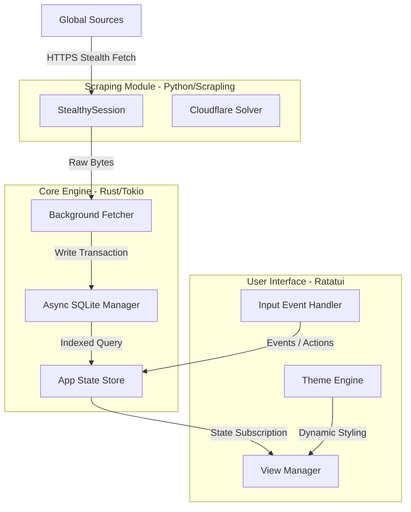

# 🚀 Live News TUI: The Ultimate Terminal Intelligence Aggregator

**Live News TUI** adalah platform agregator berita berbasis Terminal User Interface (TUI) tingkat elit. Dirancang untuk kecepatan milidetik, privasi mutlak, dan estetika profesional kelas workstation. Aplikasi ini menggabungkan sistem **Rust** yang ultra-aman dengan fleksibilitas mesin scraping **Python (Scrapling)** untuk menghadirkan berita global secara stealth, tanpa iklan, dan tanpa pelacakan.

---

## ✨ Fitur Unggulan (Elite Features)

### 🕵️ Stealth Scraping Engine (Hybrid Architecture)
Ditenagai oleh library `Scrapling` di sisi Python yang diintegrasikan secara native melalui `PyO3`.
- **Anti-Bot Bypass**: Menembus proteksi Cloudflare (403/429) secara otomatis.
- **Adaptive Extraction**: Ekstraksi konten cerdas yang menyesuaikan dengan berbagai struktur situs berita.
- **Privacy First**: Tidak ada pelacakan user, tidak ada pengumpulan data, murni lokal.

### 🌐 Cakupan Berita Masif (100+ Premium Sources)
Akses instan ke kategori berita paling berpengaruh di dunia:
- **🇮🇩 Indonesia Premium**: Detikcom, Kompas, Antara, CNN ID, CNBC ID, Tempo, Bisnis.com, Republika.
- **🌍 Geopolitik & World**: Reuters, BBC, NYT World, Al Jazeera, SCMP, The Guardian, DW, France 24.
- **💰 Finance & Global Economy**: Bloomberg, WSJ, Financial Times, The Economist, Investing.com, Forbes, Yahoo Finance.
- **🔬 Tech, AI & Innovation**: Hacker News, TechCrunch, OpenAI, DeepMind, The Verge, Wired, Ars Technica, MIT Tech Review.
- **₿ Crypto & Web3**: CoinDesk, CoinTelegraph, Bitcoin Magazine, Decrypt, The Block.
- **🧪 Science, Health & Space**: NASA, Nature, Science Daily, National Geographic, WHO, LiveScience, Quanta.
- **🎭 Lifestyle & Culture**: Vogue, GQ, Vanity Fair, Rolling Stone, Architectural Digest, Esquire.
- **⚽ Sports & Gaming**: ESPN, BBC Sport, Sky Sports, FIFA, IGN, GameSpot, Kotaku, Polygon.
- **⚖️ Legal & Auto**: SCOTUSblog, DOJ News, Law.com, Autoblog, Car and Driver, MotorTrend.

### ⚡ Performa Workstation Modern
- **Rust/Tokio Core**: Arsitektur asinkron yang mampu menangani ratusan feed tanpa beban CPU.
- **SQLite WAL Mode**: Database teroptimasi dengan Write-Ahead Logging untuk performa disk I/O maksimal.
- **O(1) Render UI**: Pipeline rendering berbasis event yang hanya memproses data saat dibutuhkan.

---

## 🏛️ Arsitektur Sistem

### Visual Alur Data (Mermaid)



---

## 🛠️ Panduan Instalasi & DevOps

### 1. Prasyarat
- **Rust Toolchain** (v1.75+)
- **Python** (v3.10+)
- **Scrapling**: `pip install scrapling`

### 2. Instalasi Satu Perintah
```bash
./install.sh
```
Skrip otomatis akan mengonfigurasi dependensi, mengompilasi biner performa tinggi (`--release`), dan mendaftarkannya ke PATH sistem.

### 3. Pemeliharaan
- **Update**: `./update.sh` (Pembaruan kode dan re-build otomatis).
- **Uninstall**: `./uninstall.sh` (Penghapusan bersih).

---

## ⌨️ Navigasi & Pintasan Keyboard (Quick Reference)

| Tombol | Aksi |
| :--- | :--- |
| `/` | **Search**: Cari berita secara instan di semua kategori |
| `t` | **Theme**: Ganti tema (Black, White, DeepBlue, Matrix) |
| `o` | **Open**: Buka URL berita di Browser sistem default |
| `Enter` | **Read**: Baca detail artikel di dalam terminal |
| `Esc / q` | **Back**: Kembali ke daftar berita atau keluar aplikasi |
| `h / l` | **Category**: Navigasi antar tab kategori (Kiri/Kanan) |
| `j / k` | **Navigate**: Scroll daftar berita (Atas/Bawah) |
| `?` | **Help**: Tampilkan jendela bantuan |

---

## ⚙️ Konfigurasi (config.toml)
Lokasi: `~/.config/live_news_tui/config.toml`
- `fetch_interval_active_seconds`: Interval sinkronisasi (Default: 60s).
- `retention`: Masa simpan data (Hourly, Daily, Weekly).
- `theme`: Tema awal saat dijalankan.

---

## 📄 Lisensi
Proyek ini **100% Open Source & Gratis** selamanya.

---
*Built with ❤️ by Senior Rust Engineers for the global intelligence community.*
