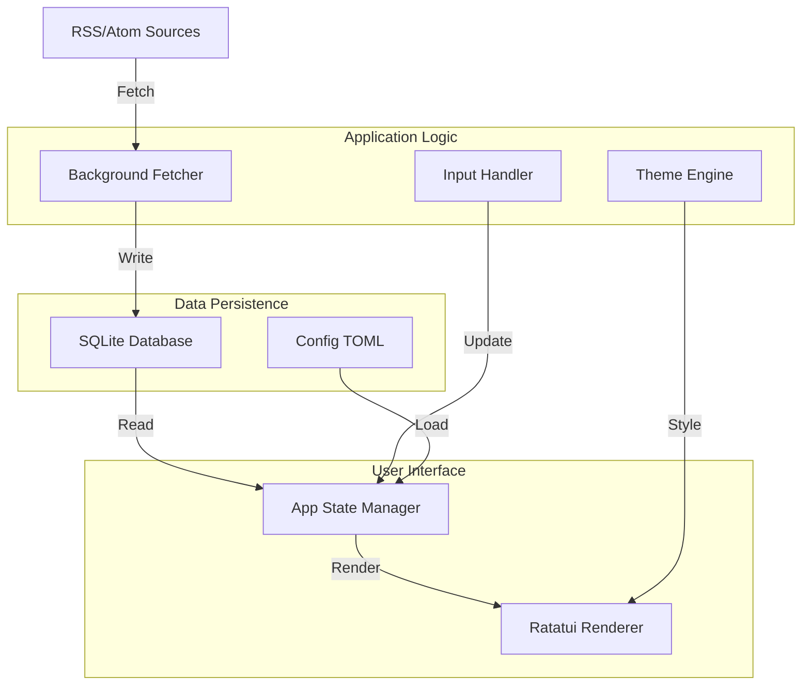

# Live News TUI 🚀

Live News TUI adalah aplikasi Terminal User Interface (TUI) berbasis Rust yang menyediakan feed berita real-time secara gratis, cepat, dan efisien. Terinspirasi dari estetika **GitUI**, aplikasi ini menawarkan pengalaman navigasi keyboard-only yang responsif.

## ✨ Fitur Utama

- **Estetika GitUI**: Layout modern dengan border bulat dan skema warna yang konsisten.
- **Color Themes**: Pilihan tema warna (Black, White, DeepBlue, Matrix) yang dapat diubah secara instan.
- **Search & Filter**: Cari berita secara real-time dengan menekan `/`.
- **Real-Time Feed**: Update berita otomatis di latar belakang menggunakan SQLite asinkron.
- **Production-Ready**: Manajemen retensi data otomatis dan konfigurasi TOML.
- **Hemat Sumber Daya**: Penggunaan CPU dan RAM minimal berkat Rust & Tokio.

## 🏛️ Arsitektur Sistem

### Alur Data Visual (Mermaid)



### Visual ASCII Architecture

```text
+-----------------------------------------------------------+
|                      LIVE NEWS TUI (UI)                   |
|  +-----------------------+   +-------------------------+  |
|  |   Category Sidebar    |   |     News Feed List      |  |
|  +-----------------------+   +-------------------------+  |
|             |                             ^               |
|             v                             |               |
+-----------------------------------------------------------+
|                    App State Manager                      |
|  (State, Theme, Search, ViewMode: Main/Reading/Popup)     |
+-------------+-----------------------+---------------------+
              |                       ^
              v                       |
+---------------------------+   +---------------------------+
|      Config (TOML)        |   |      Database (SQLite)    |
+---------------------------+   +-------------+-------------+
                                              ^
                                              |
                                +-------------+-------------+
                                |    Background Fetcher     |
                                |  (Async Tasks via Tokio)  |
                                +-------------+-------------+
                                              |
                                              v
                                +---------------------------+
                                |   External News Sources   |
                                +---------------------------+
```

## 🛠️ Manajemen Aplikasi

### 📥 Instalasi
```bash
./install.sh
```

### 🔄 Update & 🗑️ Uninstall
```bash
./update.sh
./uninstall.sh
```

## ⌨️ Navigasi & Pintasan

- **/** : Buka Pencarian (Search).
- **t** : Ganti Tema Warna (Black -> White -> DeepBlue -> Matrix).
- **Enter** : Baca detail artikel.
- **Esc / q** : Kembali atau Keluar.
- **h / l** : Ganti kategori.
- **j / k** : Navigasi daftar.
- **?** : Tampilkan bantuan.

## 📄 Lisensi

Sepenuhnya gratis untuk digunakan.
